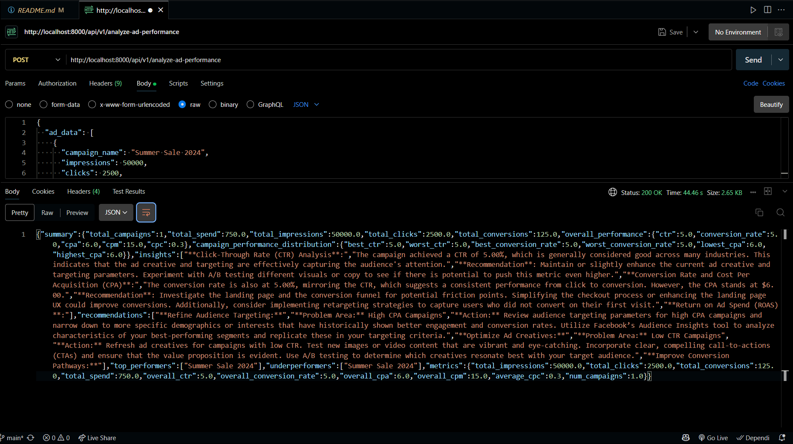
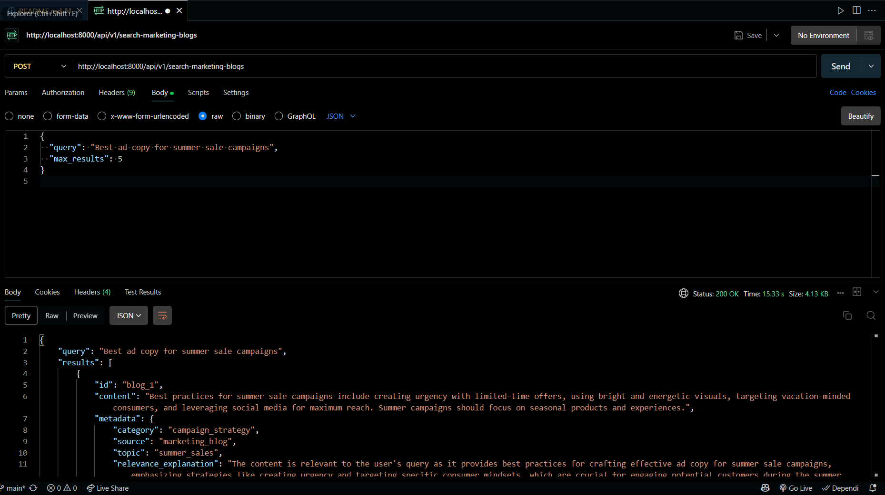
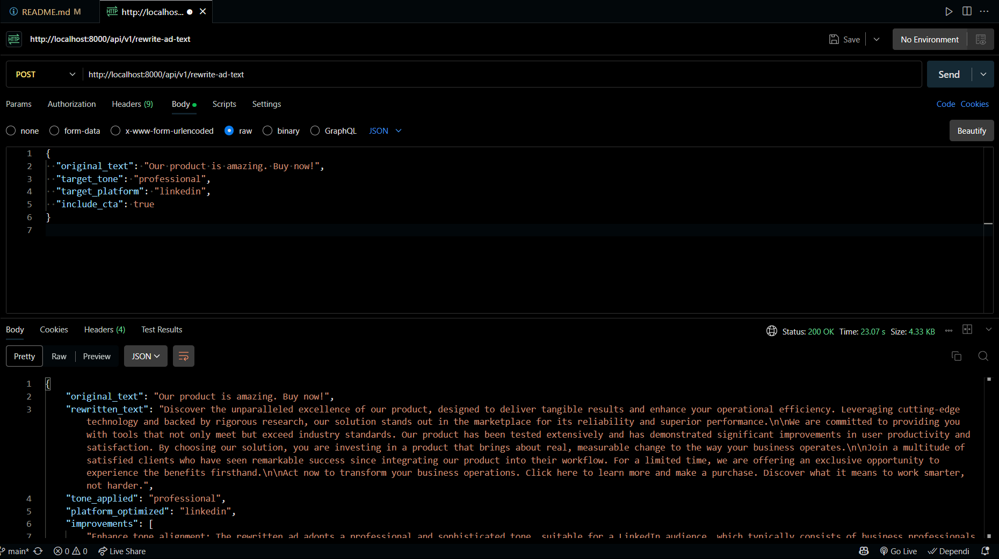
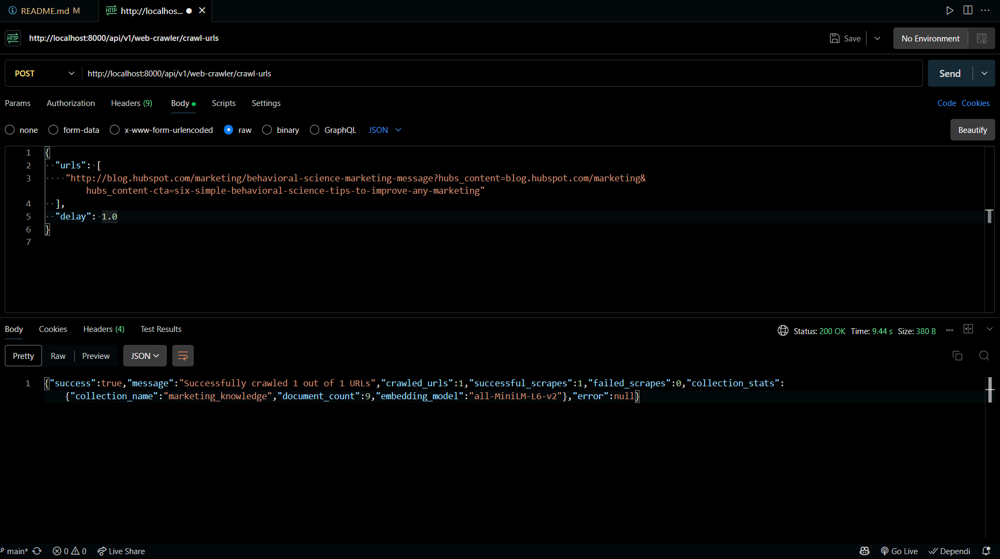
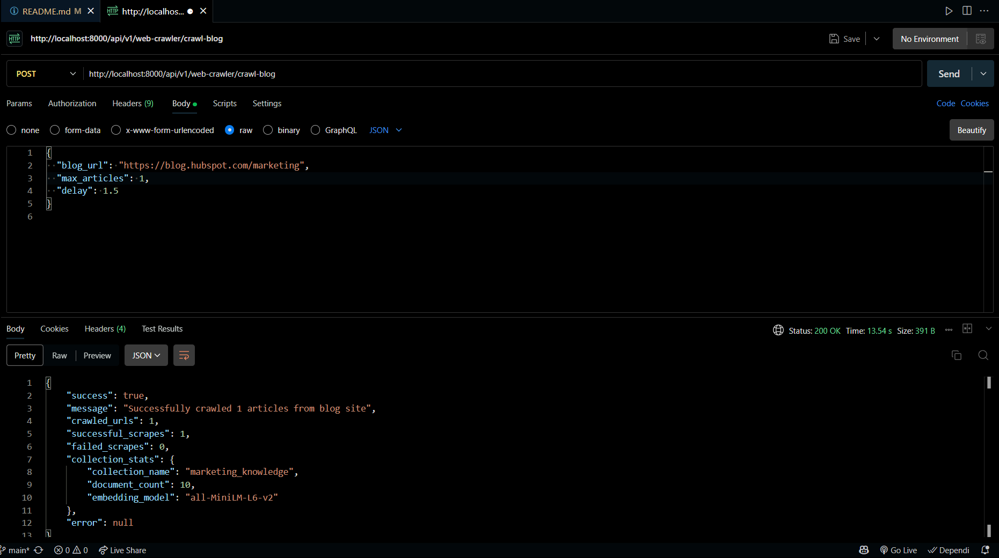
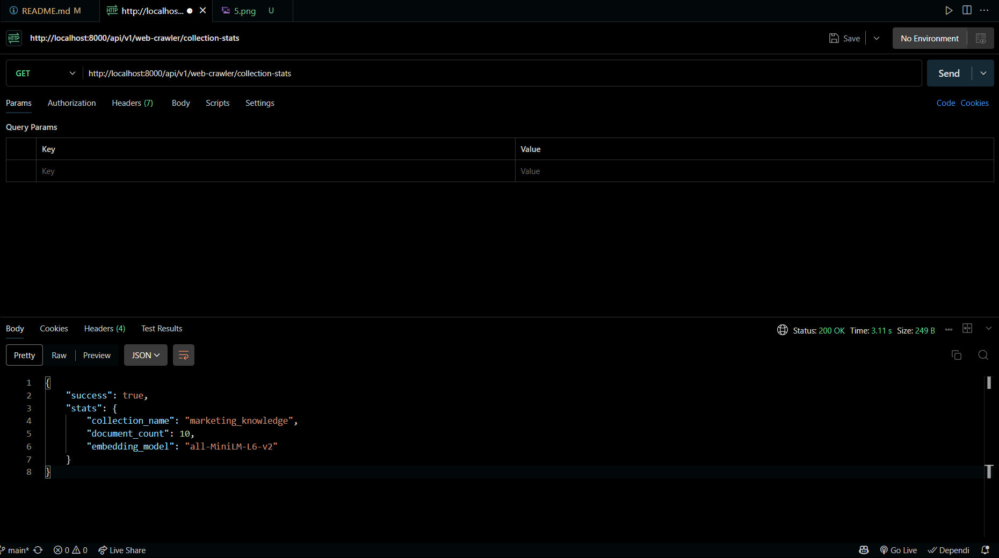

# Marketing AI Agents

A lightweight FastAPI-based system providing specialized AI agents for marketing research tasks, built with Azure OpenAI and ChromaDB, including intelligent web crawling capabilities.

## 🚀 Quick Start

1. **Clone and Setup**
   ```bash
   cd marketing-ai-agents
   cp .env.example .env
   # Edit .env with your Azure OpenAI credentials
   ```

2. **Install Dependencies**
   ```bash
   pip install -r requirements.txt
   ```

3. **Run the Application**
   ```bash
   python main.py
   # or
   uvicorn app.main:app --reload
   ```

4. **Access the API**
   - API Documentation: http://localhost:8000/docs
   - Alternative Docs: http://localhost:8000/redoc
   - Health Check: http://localhost:8000/health

## 🤖 Available Agents

### 1. Ad Performance Analyzer (`/api/v1/analyze-ad-performance`)
Reviews Meta/Google ad performance CSVs and provides AI-powered insights and creative improvement suggestions.

**Features:**
- Comprehensive performance analysis
- AI-generated insights and recommendations
- Top/underperformer identification
- Metrics calculation and benchmarking

### 2. Marketing Blog Search Agent (`/api/v1/search-marketing-blogs`)
Multi-step agent using ChromaDB vector database to search marketing blogs and answer queries with Agentic RAG.

**Features:**
- Semantic search across marketing content
- Query expansion for comprehensive coverage
- AI-enhanced relevance explanations
- Suggested related queries

### 3. Ad Text Rewriter (`/api/v1/rewrite-ad-text`)
Rewrites ad text using different tones and optimizes for various platforms.

**Features:**
- 6 tone types (professional, fun, casual, urgent, friendly, authoritative)
- 6 platform optimizations (Facebook, Instagram, Google, LinkedIn, Twitter, TikTok)
- Alternative versions for A/B testing
- Platform-specific optimization tips

### 4. Web Crawler (`/api/v1/web-crawler/`)
Intelligent web crawler that scrapes marketing blog content and adds it to the ChromaDB knowledge base.

**Features:**
- Smart content extraction from marketing blogs
- Duplicate prevention using content-based hashing
- Rate limiting and respectful crawling
- Metadata extraction (titles, descriptions, dates)
- Background processing for large crawling jobs
- Auto-discovery of blog articles from site URLs
- Collection statistics and search capabilities

### 5. Evaluation Framework (`evaluation/`)
Comprehensive evaluation system for testing and benchmarking all marketing AI agents with advanced metrics.

**Features:**
- Relevance scoring using semantic similarity
- Hallucination detection and factual accuracy assessment
- F1 scores for extraction and retrieval tasks
- ROUGE scores for summary quality evaluation
- Content quality analysis with marketing-specific metrics
- Automated test case generation for all agents
- Benchmark datasets for consistent evaluation
- Detailed reporting with CSV and JSON outputs

## 🏗️ Architecture & Tools

### Core Technologies
- **FastAPI**: High-performance async web framework
- **Azure OpenAI**: GPT-4 for text generation and analysis
- **ChromaDB**: Vector database for semantic search
- **Requests & BeautifulSoup**: Web scraping and HTML parsing
- **Pydantic**: Data validation and serialization

### AI/ML Stack
- **LangChain**: Agent orchestration and prompt management
- **Sentence Transformers**: Text embeddings for vector search
- **Tiktoken**: Token counting and management

### Agent Architecture
Each agent follows a modular design pattern:
```
Agent Class → Router → FastAPI Endpoint
     ↑
Azure OpenAI Client ← ChromaDB Client (for search agent)
```

## 🧠 Technical Deep Dive

### 1️⃣ Agentic RAG Implementation

The Blog Search Agent implements a sophisticated Agentic RAG pipeline:

**Multi-Step Process:**
1. **Query Analysis**: AI analyzes user intent and expands query terms
2. **Vector Search**: Semantic search in ChromaDB using sentence transformers
3. **Multi-Query Search**: Performs additional searches with expanded terms
4. **Result Enhancement**: AI generates relevance explanations and context
5. **Query Suggestions**: Recommends related queries based on results

**Graph RAG Elements:**
- Query expansion creates a graph of related concepts
- Multi-step reasoning chains knowledge from different sources
- Context aggregation improves recall and precision

### 2️⃣ Knowledge Graph Integration

While not implementing a full knowledge graph, the system uses structured metadata to represent domain knowledge:

**Entity Relationships:**
```
Marketing Topic → Category → Platform → Tone
     ↓              ↓         ↓        ↓
  summer_sales → ad_copy → facebook → fun
```

**Knowledge Structure:**
- Topics: campaign_strategy, ad_copy, performance_optimization
- Platforms: facebook, instagram, google, linkedin
- Tones: professional, casual, fun, urgent
- Metrics: CTR, CPA, ROAS, conversion_rate

**Future Knowledge Graph Enhancements:**
- Explicit entity relationships (Platform→AudienceType→TonePreference)
- Campaign performance patterns (Industry→Platform→SuccessMetrics)
- Competitive intelligence relationships (Brand→Strategy→Performance)

### 3️⃣ Evaluation Strategy

**Automated Metrics:**
- **Relevance Score**: Cosine similarity between query and results (0-1 scale)
- **Response Time**: Vector search and AI generation latency
- **Token Usage**: Cost monitoring for Azure OpenAI calls
- **Error Rate**: Failed requests and fallback usage

**Quality Metrics:**
- **ROUGE Scores**: For summary quality in insights generation
- **Semantic Similarity**: Between original and rewritten ad text
- **Tone Classification**: Accuracy of tone application
- **Platform Compliance**: Character limits and best practices adherence

**Manual Evaluation Framework:**
```python
# Example evaluation criteria
evaluation_criteria = {
    "relevance": "How well do results match the query intent? (1-5)",
    "actionability": "How practical are the recommendations? (1-5)",
    "accuracy": "How factually correct is the information? (1-5)",
    "creativity": "How creative are the rewritten ads? (1-5)"
}
```

### 4️⃣ Intelligent Web Crawling System

The Web Crawler implements a sophisticated content extraction and knowledge base enhancement system:

**Smart Content Extraction:**
- Intelligent HTML parsing with multiple content selectors
- Automatic filtering of navigation, scripts, and irrelevant content
- Content quality assessment (minimum length, relevance scoring)
- Metadata extraction (titles, descriptions, publish dates)

**Duplicate Prevention:**
- Content-based hashing to prevent duplicate entries
- URL normalization and canonicalization
- Similar content detection using text similarity

**Respectful Crawling:**
- Configurable rate limiting between requests
- Robots.txt compliance awareness
- Error handling for failed requests and timeouts
- Background processing for large crawling jobs

**Knowledge Base Integration:**
- Automatic ChromaDB integration with proper embeddings
- Structured metadata for enhanced search capabilities
- Content categorization and tagging
- Search functionality for crawled content

**Auto-Discovery Features:**
- Blog site structure analysis
- Article link discovery from main blog pages
- Pagination handling for multi-page blog sites
- Content freshness detection

### 5️⃣ Agent Integration & Knowledge Enhancement

The Web Crawler creates a continuous feedback loop that enhances all marketing agents:

**Content Discovery Pipeline:**
```
Marketing Blogs → Web Crawler → Content Extraction → ChromaDB → All AI Agents
```

**Cross-Agent Benefits:**
- **Blog Search Agent**: Expanded corpus of marketing articles and insights
- **Ad Performance Agent**: Access to latest industry best practices and benchmarks
- **Ad Rewriter Agent**: Enhanced understanding of current marketing language and trends

**Knowledge Base Multiplication:**
- Each crawled article potentially improves responses across all agents
- Real-time expansion of domain expertise
- Automatic discovery of emerging marketing trends and strategies
- Continuous improvement without manual content curation

**Synergistic Effects:**
- Crawled performance case studies enhance Ad Performance analysis
- Latest ad copy examples improve Ad Rewriter capabilities
- Fresh blog content keeps Blog Search results current and relevant
- Cross-pollination of marketing concepts across different agent specializations

## 🔧 Configuration

### Environment Variables
```bash
# Azure OpenAI
AZURE_OPENAI_ENDPOINT=https://your-resource.openai.azure.com/
AZURE_OPENAI_API_KEY=your-api-key
AZURE_OPENAI_API_VERSION=2024-02-15-preview
AZURE_OPENAI_DEPLOYMENT_NAME=gpt-4
AZURE_OPENAI_EMBEDDING_DEPLOYMENT=text-embedding-ada-002

# ChromaDB
CHROMA_DB_PATH=./data/chroma_db
CHROMA_COLLECTION_NAME=marketing_knowledge

# API Configuration
API_HOST=0.0.0.0
API_PORT=8000
API_RELOAD=true
```

### Project Structure
```
marketing-ai-agents/
├── app/
│   ├── agents/          # AI agent implementations
│   │   ├── __init__.py
│   │   ├── ad_performance_agent.py
│   │   ├── ad_rewriter_agent.py
│   │   └── blog_search_agent.py
│   ├── database/        # ChromaDB client and utilities
│   │   ├── __init__.py
│   │   └── chroma_client.py
│   ├── models/          # Pydantic schemas
│   │   ├── __init__.py
│   │   └── schemas.py
│   ├── routers/         # FastAPI route handlers
│   │   ├── __init__.py
│   │   ├── ad_performance.py
│   │   ├── ad_rewriter.py
│   │   ├── blog_search.py
│   │   └── web_crawler.py
│   ├── utils/           # Shared utilities and config
│   │   ├── __init__.py
│   │   ├── azure_openai_client.py
│   │   ├── config.py
│   │   └── web_crawl.py
│   └── main.py          # FastAPI application setup
├── data/                # Data storage (ChromaDB, metrics)
├── evaluation/          # Evaluation framework and metrics
│   ├── __init__.py
│   ├── evaluator.py     # Main evaluation orchestrator
│   ├── metrics.py       # Relevance, F1, ROUGE, hallucination metrics
│   ├── test_data.py     # Test data generation and benchmarks
│   ├── run_evaluation.py # Command-line evaluation runner
│   └── README.md        # Evaluation framework documentation
├── examples/            # Example scripts and usage demos
│   └── crawl_example.py
├── main.py              # Application entry point
├── requirements.txt     # Python dependencies
└── README.md            # This file
```

## 📝 API Examples

### Ad Performance Analysis
```bash
curl -X POST "http://localhost:8000/api/v1/analyze-ad-performance" \
  -H "Content-Type: application/json" \
  -d '{
    "ad_data": [
      {
        "campaign_name": "Summer Sale 2024",
        "impressions": 50000,
        "clicks": 2500,
        "conversions": 125,
        "spend": 750.00
      }
    ]
  }'
```

```bash
{
    "summary": {
        "total_campaigns": 1,
        "total_spend": 750.0,
        "total_impressions": 50000.0,
        "total_clicks": 2500.0,
        "total_conversions": 125.0,
        "overall_performance": {
            "ctr": 5.0,
            "conversion_rate": 5.0,
            "cpa": 6.0,
            "cpm": 15.0,
            "cpc": 0.3
        },
        "campaign_performance_distribution": {
            "best_ctr": 5.0,
            "worst_ctr": 5.0,
            "best_conversion_rate": 5.0,
            "worst_conversion_rate": 5.0,
            "lowest_cpa": 6.0,
            "highest_cpa": 6.0
        }
    },
    "insights": [
        "**Click-Through Rate (CTR) Analysis**:",
        "The campaign achieved a CTR of 5.00%, which is generally considered good across many industries. This indicates that the ad creative and targeting are effectively capturing the audience's attention.",
        "**Recommendation**: Maintain or slightly enhance the current ad creative and targeting parameters. Experiment with A/B testing different visuals or copy to see if there is potential to push this metric even higher.",
        "**Conversion Rate and Cost Per Acquisition (CPA)**:",
        "The conversion rate is also at 5.00%, mirroring the CTR, which suggests a consistent performance from click to conversion. However, the CPA stands at $6.00.",
        "**Recommendation**: Investigate the landing page and the conversion funnel for potential friction points. Simplifying the checkout process or enhancing the landing page UX could improve conversions. Additionally, consider implementing retargeting strategies to capture users who did not convert on their first visit.",
        "**Return on Ad Spend (ROAS)**:"
    ],
    "recommendations": [
        "**Refine Audience Targeting:**",
        "**Problem Area:** High CPA Campaigns",
        "**Action:** Review audience targeting parameters for high CPA campaigns and narrow down to more specific demographics or interests that have historically shown better engagement and conversion rates. Utilize Facebook’s Audience Insights tool to analyze characteristics of your best-performing segments and replicate these in your targeting criteria.",
        "**Optimize Ad Creatives:**",
        "**Problem Area:** Low CTR Campaigns",
        "**Action:** Refresh ad creatives for campaigns with low CTR. Test new images or video content that are vibrant and eye-catching. Incorporate clear, compelling call-to-actions (CTAs) and ensure that the value proposition is evident. Use A/B testing to determine which creatives resonate best with your target audience.",
        "**Improve Conversion Pathways:**"
    ],
    "top_performers": [
        "Summer Sale 2024"
    ],
    "underperformers": [
        "Summer Sale 2024"
    ],
    "metrics": {
        "total_impressions": 50000.0,
        "total_clicks": 2500.0,
        "total_conversions": 125.0,
        "total_spend": 750.0,
        "overall_ctr": 5.0,
        "overall_conversion_rate": 5.0,
        "overall_cpa": 6.0,
        "overall_cpm": 15.0,
        "average_cpc": 0.3,
        "num_campaigns": 1.0
    }
}
```



### Marketing Blog Search
```bash
curl -X POST "http://localhost:8000/api/v1/search-marketing-blogs" \
  -H "Content-Type: application/json" \
  -d '{
    "query": "Best ad copy for summer sale campaigns",
    "max_results": 5
  }'
```

```bash
{
    "query": "Best ad copy for summer sale campaigns",
    "results": [
        {
            "id": "blog_1",
            "content": "Best practices for summer sale campaigns include creating urgency with limited-time offers, using bright and energetic visuals, targeting vacation-minded consumers, and leveraging social media for maximum reach. Summer campaigns should focus on seasonal products and experiences.",
            "metadata": {
                "category": "campaign_strategy",
                "source": "marketing_blog",
                "topic": "summer_sales",
                "relevance_explanation": "The content is relevant to the user's query as it provides best practices for crafting effective ad copy for summer sale campaigns, emphasizing strategies like creating urgency and targeting specific consumer mindsets, which are crucial for engaging potential customers during the summer season."
            },
            "relevance_score": 0.293
        },
        {
            "id": "blog_2",
            "content": "Effective ad copy for Facebook campaigns should be concise, include a clear call-to-action, use emotional triggers, test different headlines, and incorporate social proof. A/B testing different copy variations is crucial for optimization.",
            "metadata": {
                "category": "ad_copy",
                "source": "marketing_blog",
                "topic": "facebook_ads",
                "relevance_explanation": "The content is relevant to the user's query as it provides specific strategies for creating effective ad copy, which can be applied to crafting compelling ads for summer sale campaigns. It also emphasizes the importance of A/B testing, which is crucial for optimizing ad performance during such campaigns."
            },
            "relevance_score": 0.007
        },
        {
            "id": "blog_8",
            "content": "Creative improvement strategies for underperforming ads include testing new visuals, updating copy, changing call-to-action buttons, adjusting targeting parameters, and analyzing competitor strategies.",
            "metadata": {
                "category": "improvement_strategies",
                "source": "marketing_blog",
                "topic": "creative_optimization",
                "relevance_explanation": "The content is relevant to the user's query as it provides strategies for enhancing ad copy, including updating the copy itself, which is directly applicable to creating effective ad copy for summer sale campaigns. Additionally, it suggests analyzing competitor strategies, which can offer insights into successful ad copy trends and practices during the summer sale period."
            },
            "relevance_score": 0.0
        },
        {
            "id": "blog_3",
            "content": "Google Ads performance can be improved by focusing on keyword relevance, improving quality scores, optimizing landing pages, using negative keywords, and implementing proper bidding strategies. Regular performance monitoring is essential.",
            "metadata": {
                "category": "performance_optimization",
                "source": "marketing_blog",
                "topic": "google_ads",
                "relevance_explanation": "The content is relevant to the user's query as it provides strategies to enhance Google Ads performance, which can be applied to creating effective ad copy for summer sale campaigns. By focusing on keyword relevance and optimizing landing pages, users can develop targeted ad copy that resonates with their audience during summer sales."
            },
            "relevance_score": 0.0
        },
        {
            "id": "blog_7",
            "content": "Ad performance metrics to track include click-through rate (CTR), conversion rate, cost per acquisition (CPA), return on ad spend (ROAS), and quality score. These metrics help optimize campaign effectiveness.",
            "metadata": {
                "category": "analytics",
                "source": "marketing_blog",
                "topic": "performance_metrics",
                "relevance_explanation": "The content is relevant to the user's query because it provides key performance metrics such as CTR and conversion rate that are essential for evaluating and optimizing the effectiveness of ad copy used in summer sale campaigns. Understanding these metrics allows users to refine their ad copy to achieve better results."
            },
            "relevance_score": 0.0
        }
    ],
    "total_results": 5,
    "search_time_ms": 15291.78,
    "suggested_queries": [
        "How to optimize Google Ads for seasonal campaigns like summer sales?",
        "What are effective A/B testing strategies for ad copy in Facebook Ads?",
        "What key performance metrics should be monitored during a summer sale campaign?",
        "How can creative optimization improve conversion rates in summer sales campaigns?"
    ]
}
```



The reason why the relevance score 0 is I didnt scrape enough data and vectorized. 

### Ad Text Rewriting
```bash
curl -X POST "http://localhost:8000/api/v1/rewrite-ad-text" \
  -H "Content-Type: application/json" \
  -d '{
    "original_text": "Our product is amazing. Buy now!",
    "target_tone": "professional",
    "target_platform": "linkedin",
    "include_cta": true
  }'
```

```bash
{
    "original_text": "Our product is amazing. Buy now!",
    "rewritten_text": "Discover the unparalleled excellence of our product, designed to deliver tangible results and enhance your operational efficiency. Leveraging cutting-edge technology and backed by rigorous research, our solution stands out in the marketplace for its reliability and superior performance.\n\nWe are committed to providing you with tools that not only meet but exceed industry standards. Our product has been tested extensively and has demonstrated significant improvements in user productivity and satisfaction. By choosing our solution, you are investing in a product that brings about real, measurable change to the way your business operates.\n\nJoin a multitude of satisfied clients who have seen remarkable success since integrating our product into their workflow. For a limited time, we are offering an exclusive opportunity to experience the benefits firsthand.\n\nAct now to transform your business operations. Click here to learn more and make a purchase. Discover what it means to work smarter, not harder.",
    "tone_applied": "professional",
    "platform_optimized": "linkedin",
    "improvements": [
        "Enhance tone alignment: The rewritten ad adopts a professional and sophisticated tone, suitable for a LinkedIn audience, which typically consists of business professionals and industry leaders.",
        "Optimize for platform: The detailed explanation of the product’s benefits and its impact on operational efficiency caters to the LinkedIn community's interest in productivity and professional growth.",
        "Increase engagement factors: The rewritten ad uses compelling language such as \"unparalleled excellence,\" \"cutting-edge technology,\" and \"rigorous research,\" which are likely to engage readers by highlighting the unique attributes and credibility of the product.",
        "Strengthen conversion elements: The ad includes specific outcomes like \"significant improvements in user productivity and satisfaction,\" which directly address the results potential customers can expect, making the ad more persuasive.",
        "Improve clarity and impact: The detailed description of the product’s features and benefits provides clarity and builds a strong case for the product’s effectiveness, thereby enhancing the overall impact of the ad.",
        "Enhance call-to-action effectiveness: The call-to-action \"Act now to transform your business operations\" coupled with an invitation to \"Click here to learn more and make a purchase\" is clear, compelling, and directly linked to the benefits described, which can effectively drive conversions."
    ],
    "platform_specific_tips": [
        "**Leverage LinkedIn's Networking Focus**: Start your ad by addressing the common challenges or goals of your target industry to immediately resonate with business professionals. Example: \"Struggling with operational inefficiencies? You're not alone. Discover how our product has revolutionized workflows for businesses like yours.\"",
        "**Highlight Industry Insights**: Incorporate statistics or case studies that underscore the reliability and superior performance of your product. This not only builds credibility but also caters to the data-driven preferences of LinkedIn users. Example: \"Join the 500+ companies experiencing a 70% increase in productivity with our solution.\"",
        "**Optimize for Professional Tone**: Maintain a formal yet engaging tone throughout the ad. Avoid slang and focus on the business value of your product. Example: Replace \"Act now to transform your business operations\" with \"Seize this opportunity to elevate your business operations to new heights.\"",
        "**Technical Optimization - Use Rich Media**: Enhance your ad with relevant images or short videos that demonstrate your product in action. Visuals are engaging and can help explain complex information more effectively, which is ideal for the LinkedIn audience."
    ],
    "alternative_versions": [
        "Experience unparalleled efficiency with our cutting-edge solution. Elevate your professional standards today. Discover more!",
        "Transform your workflow with our innovative product, designed to meet the demands of industry leaders. Invest in excellence. Learn how!",
        "Why settle for ordinary? Our product delivers exceptional performance enhancements. Explore the benefits for your team now. Get started!"
    ]
}
```



### Web Crawler - Crawl Specific URLs
```bash
curl -X POST "http://localhost:8000/api/v1/web-crawler/crawl-urls" \
  -H "Content-Type: application/json" \
  -d '{
    "urls": [
      "https://blog.hubspot.com/marketing/facebook-ads-guide",
      "https://blog.hootsuite.com/social-media-advertising/"
    ],
    "delay": 1.0
  }'
```

```bash
{
  "success": true,
  "message": "Successfully crawled 1 out of 1 URLs",
  "crawled_urls": 1,
  "successful_scrapes": 1,
  "failed_scrapes": 0,
  "collection_stats": {
    "collection_name": "marketing_knowledge",
    "document_count": 9,
    "embedding_model": "all-MiniLM-L6-v2"
  },
  "error": null
}

```



### Web Crawler - Auto-Discover Blog Articles
```bash
curl -X POST "http://localhost:8000/api/v1/web-crawler/crawl-blog" \
  -H "Content-Type: application/json" \
  -d '{
    "blog_url": "https://blog.hubspot.com/marketing",
    "max_articles": 10,
    "delay": 1.5
  }'
```

```bash
{
    "success": true,
    "message": "Successfully crawled 1 articles from blog site",
    "crawled_urls": 1,
    "successful_scrapes": 1,
    "failed_scrapes": 0,
    "collection_stats": {
        "collection_name": "marketing_knowledge",
        "document_count": 10,
        "embedding_model": "all-MiniLM-L6-v2"
    },
    "error": null
}
```



### Web Crawler - Collection Statistics
```bash
curl -X GET "http://localhost:8000/api/v1/web-crawler/collection-stats"
```

```bash
{
    "success": true,
    "stats": {
        "collection_name": "marketing_knowledge",
        "document_count": 10,
        "embedding_model": "all-MiniLM-L6-v2"
    }
}
```



### Web Crawler - Search Crawled Content
```bash
curl -X GET "http://localhost:8000/api/v1/web-crawler/search-content?query=Facebook%20advertising&n_results=5"
```


### Evaluation Framework - Run Comprehensive Evaluation
```bash
# Run full evaluation with auto-generated test cases
python evaluation/run_evaluation.py

# Generate test suite and run evaluation
python evaluation/run_evaluation.py --generate-test-suite --output-dir my_results/

# Run only benchmark validation tests
python evaluation/run_evaluation.py --benchmark-only

# Run with custom test suite
python evaluation/run_evaluation.py --test-suite custom_tests.json --log-level DEBUG
```

### 📊 Evaluation Results

The `evaluation_results/` directory contains detailed performance analysis for our RAG-based LLM system across various modules. These reports help assess the accuracy, consistency, and relevance of the generated outputs.

#### 📁 Report Breakdown

- **`ad_performance_results_*.json`**  
  Evaluation of the model's ability to analyze ad metrics and generate insights from campaign data.

- **`ad_rewriter_results_*.json`**  
  Assessment of rewritten ad texts across different tones and platforms, measuring clarity, professionalism, and relevance.

- **`blog_search_results_*.json`**  
  Evaluation of blog search query handling and relevance of retrieved content using semantic similarity.

- **`evaluation_report_*.json`**  
  A consolidated summary of all module-specific evaluations, including precision, recall, and feedback-based scoring.

- **`evaluation_results_*.json`**  
  A comprehensive report with detailed logs, scores, and model responses across all tasks evaluated.

- **`evaluation_summary_*.csv`**  
  Tabular summary of evaluation scores for quick comparison between modules.

- **`progress_report_*.json`**  
  Logs showing the step-by-step execution and intermediate outputs of the evaluation pipeline.

## 📄 License

This project is licensed under the MIT License - see the LICENSE file for details.

---